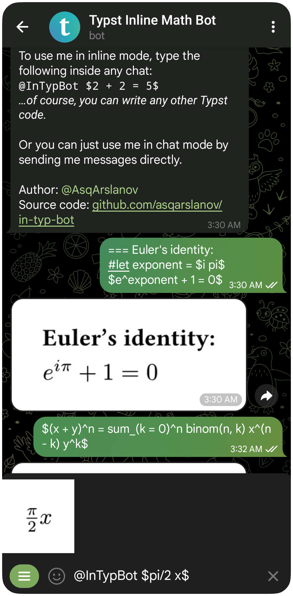

# [@InTypBot](https://t.me/InTypBot) / Typst Inline Math Bot



This Telegram bot that can render Typst markup. It works in both chat mode and
inline mode.

Try it out here: https://t.me/InTypBot

## Launch locally

After you&CloseCurlyQuote;ve cloned the repository, you need to create a `.env`
file (see [`.env.example`](/.env.example)) and specify the following variables:

- `TELOXIDE_TOKEN`: your bot&CloseCurlyQuote;s token given by
  [@BotFather](https://t.me/BotFather).
- `CACHE_CHAT_ID`: the ID of any chat where your bot is allowed to send photos
  (you&CloseCurlyQuote;d probably want to create a new private chat).

Then, you can simply start the bot with Docker Compose.

```shell
docker compose up --build
```

Alternatively, you can build and run it natively. Then, your host machine should
have the `typst` CLI installed and available in `$PATH`. The MSRV is 1.85.

```shell
cargo run --release
```

## What&CloseCurlyQuote;s up with the name?

### InTypBot

It stands for &OpenCurlyDoubleQuote;inline Typst bot.&CloseCurlyDoubleQuote;

This name (and the idea for the project in general) was inspired by
[@InLaTeXbot](https://t.me/InLaTeXbot). The more obvious names `@typbot` and
`@TypstBot` have already been taken.

### Typst Inline Math Bot

Just the most “searchable” name I came up with.

The “Math” here stands for the most common (in the author’s opinion) use case
for this bot: rendering math expressions inside Telegram.
